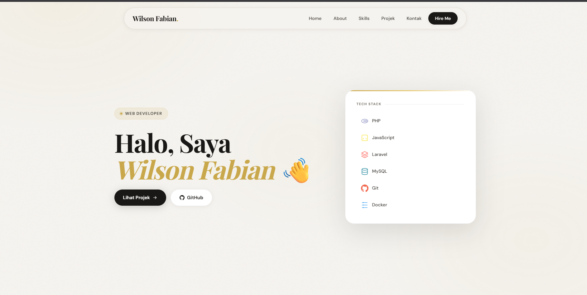
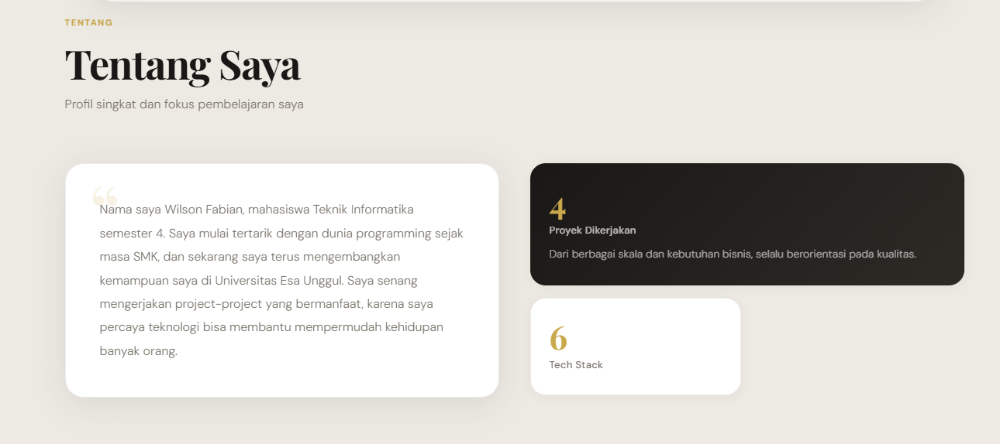
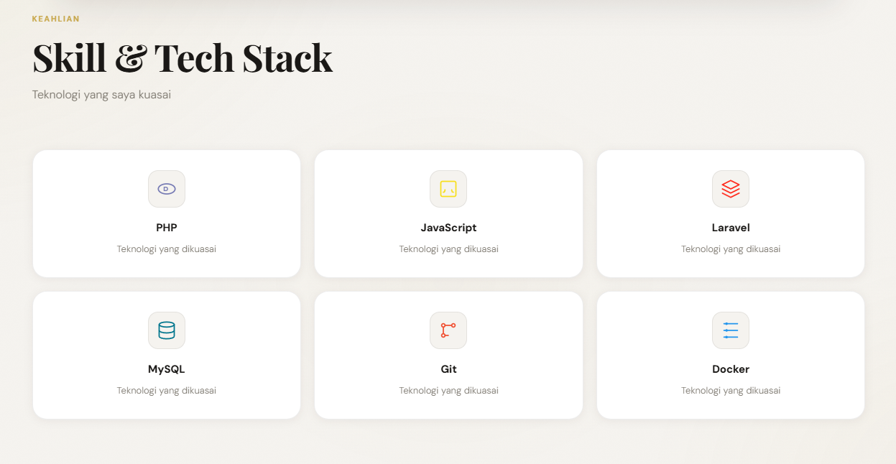
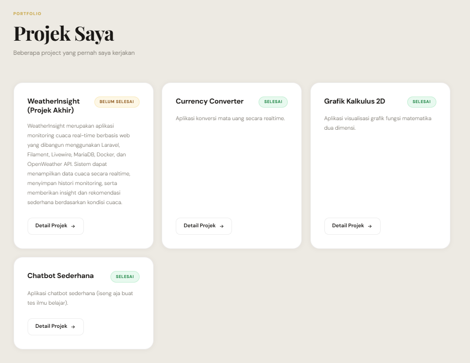
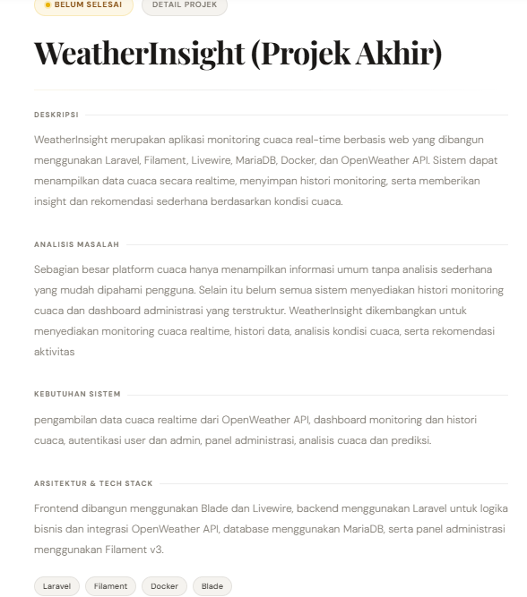
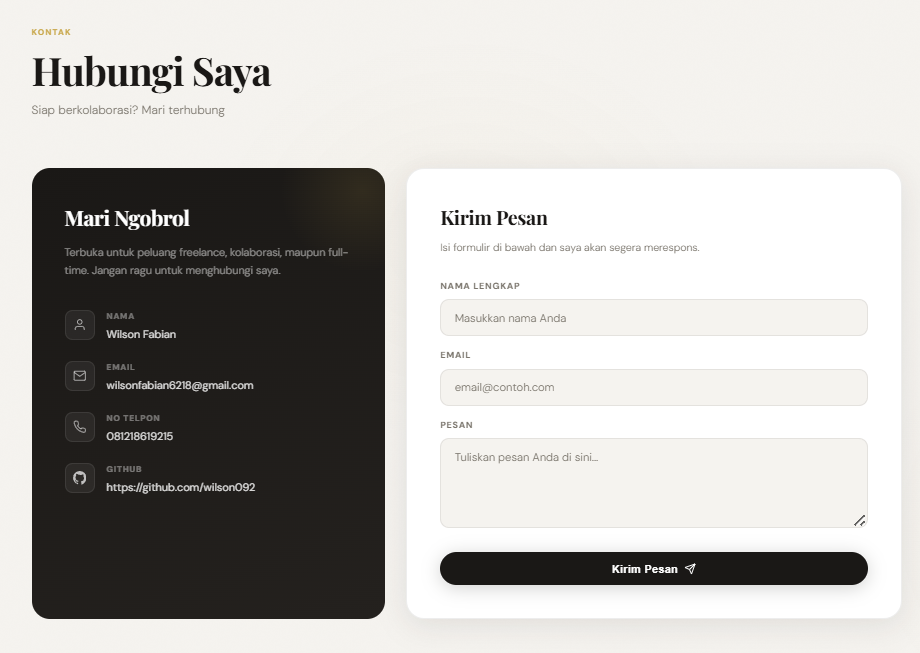
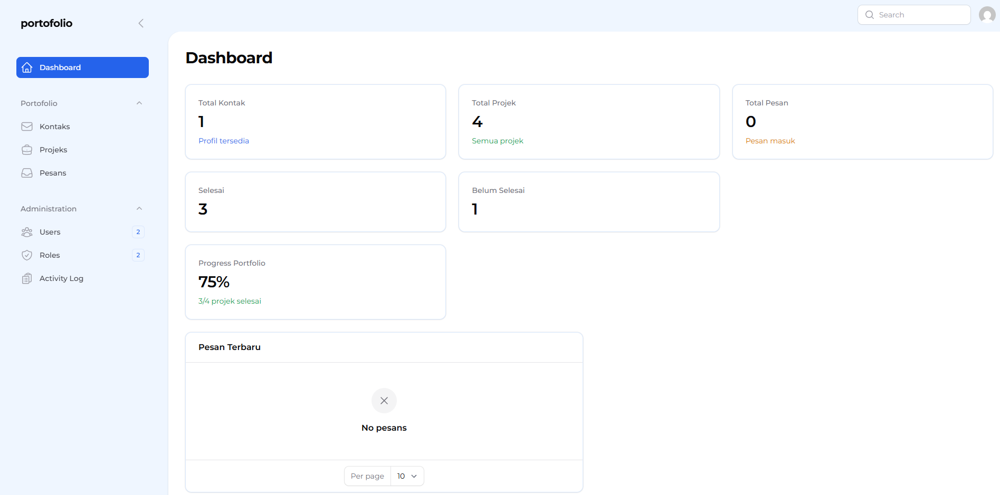
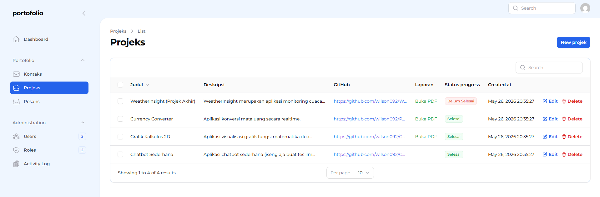
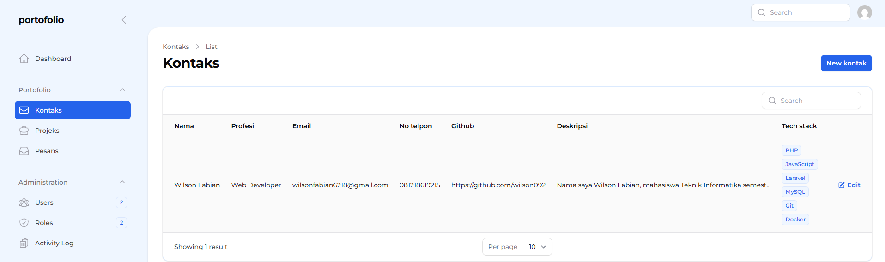

<div align="center">


<br/>


<br/>


<br/>

> 🚀 **Website portfolio personal** yang menampilkan profil, showcase proyek dinamis, dokumentasi PDF, diagram teknis, dan panel admin — semua dalam satu platform modern.

</div>

---

## ✨ Fitur Unggulan

<table>
<tr>
<td width="50%">

### 🌐 Frontend
- 🏠 Landing Page & Profil Personal
- 🗂️ Showcase Project Dinamis
- 📄 Detail Project & Laporan PDF
- 📊 Diagram (ERD / Flowchart)
- 📬 Contact Form Interaktif
- 📱 Responsive Design

</td>
<td width="50%">

### 🔧 Backend & Admin
- 🛡️ Panel Admin (Filament v3)
- ➕ Tambah & Kelola Project
- 📤 Upload PDF & Diagram
- 📈 Update Progress Project
- 🔐 Autentikasi Admin
- 🐳 Docker Environment

</td>
</tr>
</table>

---

## 🛠️ Tech Stack

<div align="center">

| Layer | Teknologi |
|-------|-----------|
| **Backend** |    |
| **Database** |  |
| **Frontend** |     |
| **DevOps** |   |

</div>

---

## 📦 Instalasi & Setup

### Prasyarat

Pastikan sudah terinstall:

- 🐳 [Docker](https://docs.docker.com/get-docker/) & Docker Compose
- 🔧 Git

---

### 🔁 Step 1 — Clone Repository

```bash
git clone <URL_REPOSITORY>
cd portofolio-2026
```

---

### 🐳 Step 2 — Jalankan Docker

```bash
# Custom command (shortcut)
dcu

# atau lengkap
docker compose up -d
```

---

### 💻 Step 3 — Masuk Container PHP

```bash
docker compose exec php bash
```

---

### 📦 Step 4 — Install Dependency

```bash
composer install
```

---

### ⚙️ Step 5 — Setup Environment

```bash
cp .env.example .env
```

Sesuaikan konfigurasi berikut di file `.env`:

```env
APP_URL=https://portofolio-2026.test

DB_CONNECTION=mariadb
DB_HOST=db
DB_PORT=3306
DB_DATABASE=portofolio
DB_USERNAME=root
DB_PASSWORD=p455w0rd
```

---

### 🔑 Step 6 — Generate App Key

```bash
dca key:generate
```

---

### 🗄️ Step 7 — Migration & Seeder

```bash
dca migrate:fresh --seed
```

---

### 🔗 Step 8 — Storage Link

```bash
dca storage:link
```

---

### 🌐 Step 9 — Akses Website

| Panel | URL |
|-------|-----|
| 🌐 Frontend | `https://portofolio-2026.test` |
| 🔐 Admin Panel | `https://portofolio-2026.test/admin` |

---

## 🚀 Panduan Penggunaan

### 👤 Frontend (Pengunjung)

Pengunjung dapat mengakses fitur berikut tanpa login:

- 👁️ Melihat profil & informasi personal
- 📂 Menjelajahi daftar project
- 📄 Membuka & mengunduh laporan PDF
- 🗺️ Melihat diagram ERD / Flowchart
- 📩 Mengirim pesan melalui contact form

---

### 🔐 Admin Panel

Login ke panel admin untuk mengelola konten:

```
URL   : https://portofolio-2026.test/admin
Email : (isi akun admin)
Pass  : (isi password)
```

Fitur admin meliputi:

| Fitur | Deskripsi |
|-------|-----------|
| ➕ Tambah Project | Buat entri project baru |
| 📤 Upload PDF | Lampirkan laporan atau dokumen |
| 🖼️ Upload Diagram | Tambahkan ERD, flowchart, dll |
| 📊 Update Progress | Perbarui status pengerjaan project |

---

## 📷 Screenshot

> Tampilan utama aplikasi Portfolio berbasis Laravel + Filament v3

---

### 🏠 Landing Page

<div align="center">



</div>

Menampilkan halaman utama portfolio beserta navigasi 

---

### 👤 About

<div align="center">



</div>

Bagian profil dan informasi personal.

---

### 🛠️ Skills & Tech Stack

<div align="center">



</div>

Menampilkan kemampuan dan teknologi yang digunakan.

---

### 📂 Project Showcase

<div align="center">



</div>

Daftar project yang ditampilkan secara dinamis.

---

### 📄 Detail Project

<div align="center">



</div>

Halaman detail project yang menampilkan:
- Deskripsi
- Tech Stack
- Diagram
- Laporan PDF
- Link GitHub

---

### 📬 Contact

<div align="center">



</div>

Form kontak untuk menerima pesan dari pengunjung.

---

## 🔐 Admin Panel (Filament v3)

### 📊 Dashboard

<div align="center">



</div>

Dashboard monitoring data aplikasi.

---

### 📁 Project Management

<div align="center">



</div>

Kelola project:
- Tambah Project
- Upload Diagram
- Upload PDF
- Update Progress

---

### 👤 Portfolio Profile Management

<div align="center">



</div>

Panel administrasi untuk mengelola informasi profil yang ditampilkan pada halaman portfolio, meliputi:

- Nama lengkap
- Nomor telepon
- Link GitHub
- Deskripsi profil
- Tech Stack
- Profesi

Seluruh perubahan akan langsung terintegrasi dengan tampilan frontend secara dinamis melalui Filament Admin Panel.

## 📂 Struktur Direktori

```
portofolio-2026/
│
├── 📁 app/
│   ├── Filament/          # Panel admin Filament
│   ├── Http/Controllers/  # Controller backend
│   └── Models/            # Model Eloquent
│
├── 📁 resources/
│   ├── views/             # Blade templates
│   └── css/               # Stylesheet
│
├── 📁 database/
│   ├── migrations/        # Skema database
│   └── seeders/           # Data awal
│
├── 📁 storage/
│   └── app/public/docs    # PDF & Diagram upload
│
├── 📁 docs/
│   └── screenshots/       # Screenshot aplikasi
│
├── 🐳 docker-compose.yml
├── ⚙️ .env.example
└── 📄 README.md
```

---

## 🗺️ Roadmap

```
✅  Portfolio Website
✅  Dynamic Project Showcase
✅  Upload PDF
✅  Diagram Support
🔄  Deployment ke Production
⏳  Analytics & Visitor Tracking
```

---

## 🤝 Kontribusi

Kontribusi sangat diterima! Berikut langkah-langkahnya:

```bash
# 1. Fork repository ini
# 2. Buat branch baru
git checkout -b feature/nama-fitur

# 3. Commit perubahan
git commit -m "feat: tambah fitur keren"

# 4. Push ke branch
git push origin feature/nama-fitur

# 5. Buat Pull Request 🎉
```

---

## 📄 Lisensi

```
MIT License

Copyright (c) 2026 Wilson Fabian

Permission is hereby granted, free of charge, to any person obtaining a copy
of this software and associated documentation files, to deal in the Software
without restriction.
```

Project ini dibuat untuk kebutuhan **akademik dan pembelajaran** di Universitas Esa Unggul.

---

## 👨‍💻 Author

<div align="center">


### Wilson Fabian

🎓 **Universitas Esa Unggul**
📋 **NIM:** 20240801098


